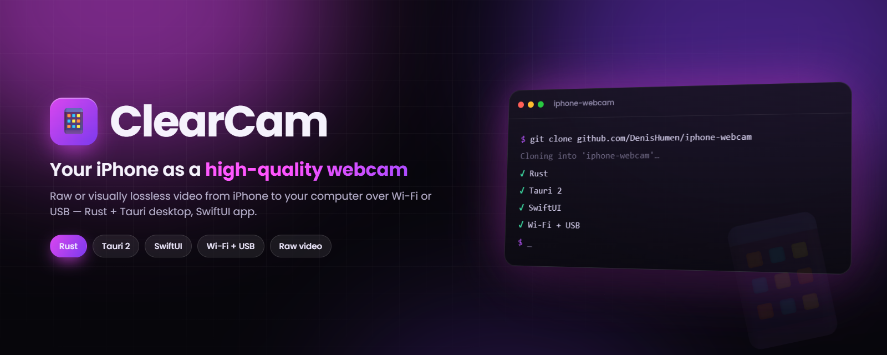
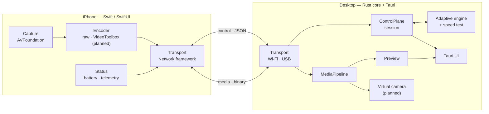

<div align="center">



# ClearCam

**Turn your iPhone into a high-quality webcam for your computer — truly uncompressed video when the link allows it, visually lossless when it does not, over Wi-Fi or USB.**

[](desktop/Cargo.toml)
[](desktop/src-tauri/tauri.conf.json)
[](desktop/ui/package.json)
[](ios/Package.swift)
[](#-roadmap)
[](https://github.com/DenisHumen/iphone-webcam/commits/main)

**English** · [Русский](README.ru.md)

[Features](#-features) · [Quick start](#-quick-start) · [Architecture](#-tech-stack--architecture) · [Roadmap](#-roadmap) · [Docs](#-documentation)

</div>

---

**ClearCam** (working title; repository `iphone-webcam`) turns an iPhone into a webcam for a desktop computer. The
iPhone captures video and sends it to the desktop over Wi-Fi or a USB cable; the desktop app shows a live preview,
lets you control the phone, and is designed to publish the stream as a **system virtual camera** that Zoom, Google
Meet, OBS and recording apps can pick up.

The core idea is **honest quality**: send truly uncompressed video when the link can carry it, and switch
automatically to a visually lossless mode (light compression you cannot tell apart by eye) when it cannot. A
built-in **speed test** decides what fits.

> [!NOTE]
> **Work in progress.** The Wi-Fi path — QR pairing, handshake, live RAW preview in the desktop app, lens switching
> and telemetry — is implemented in both apps and passes automated end-to-end tests against a Rust mock iPhone;
> on-device acceptance with a real iPhone is still pending. USB transport, the speed test and adaptive quality are
> implemented in the core and covered by end-to-end tests, but not fully wired into the apps yet. The **virtual
> camera is not built yet** — it is waiting for an Apple Developer ID. See the [roadmap](#-roadmap). The apps' UI is
> currently in Russian.

## ✨ Features

| | Feature | Status |
|---|---|---|
| 📡 | **Wi-Fi pairing by QR code** — the desktop shows a QR with host, ports and a random session token; the iPhone scans it (or you enter the values by hand) | ✅ implemented |
| 🖼 | **Live RAW preview** — NV12 frames from the iPhone camera, drop-oldest buffering, JPEG preview (≤ 30 fps) in the desktop app | ✅ implemented |
| 📷 | **Lens switching from the desktop** — front, wide, ultra-wide, telephoto (whatever the phone has) | ✅ implemented |
| 🔋 | **Device card & telemetry** — model, iOS version, battery, thermal state, sent bitrate, cameras with their max resolution and fps | ✅ implemented |
| 🔁 | **Reconnect** — the session goes to *reconnecting* on a drop and re-attaches without restarting the desktop | ✅ implemented |
| 🔌 | **USB transport** — usbmuxd via the pure-Rust `idevice` crate, per-device pairing keys, cable wins over Wi-Fi | 🧪 core + e2e tests; device list & trust UI in the desktop app |
| 🧪 | **Speed test & adaptive quality** — ramp test over the media socket, table-driven mode selection, adaptation loop with hysteresis (`SET_MODE` → `MODE_APPLIED`) | 🧪 core + e2e tests with the mock iPhone |
| 🎚 | **Hybrid quality** — raw YUV 4:2:0 ↔ visually lossless HEVC/H.264 (VideoToolbox) | ⏳ encoder/decoder not implemented yet |
| 🎥 | **System virtual camera** — CMIO Camera Extension on macOS, later Media Foundation (Windows) and v4l2loopback (Linux) | ⏳ blocked on Apple Developer ID |
| 🖥 | **Cross-platform desktop** — macOS first, then Windows, then Linux | ⏳ planned |

## 🚀 Quick start

This is a developer build: there are no releases yet.

### Prerequisites

| Part | You need |
|---|---|
| Desktop core & shell | Rust stable (`rustfmt`, `clippy`), [Tauri 2 CLI](https://tauri.app) (`cargo tauri`) |
| Desktop UI | Node.js 20 and pnpm 10 (the versions CI uses) |
| Linux desktop | Tauri 2 system packages — `libwebkit2gtk-4.1-dev`, `build-essential`, `libssl-dev`, `libayatana-appindicator3-dev`, `librsvg2-dev`, … (see [`.github/workflows/ci.yml`](.github/workflows/ci.yml)) |
| iPhone app | macOS with Xcode (Swift 5.9, iOS 17 SDK), [XcodeGen](https://github.com/yonaskolb/XcodeGen), a real iPhone on iOS 17+ |

### Desktop app

```bash
git clone https://github.com/DenisHumen/iphone-webcam.git
cd iphone-webcam/desktop
pnpm --dir ui install
cargo tauri dev
```

Click **Запустить сервер** (Start server): the app starts listening on random control and media ports and shows the
QR code.

### iPhone app

From the repository root:

```bash
./scripts/regen-xcode.sh      # generates ios/ClearCam.xcodeproj from ios/project.yml (needs xcodegen)
```

Open `ios/ClearCam.xcodeproj` in Xcode, set your `DEVELOPMENT_TEAM`, and run the `ClearCam` target on a real iPhone
(the camera does not work in the simulator). Allow camera and local-network access, scan the QR code from the
desktop, and the live preview should appear in the desktop app.

### No iPhone? Use the mock

`desktop/tools/mock-iphone` is a Rust stand-in for the phone that completes the handshake, sends telemetry and
synthetic NV12 frames. The end-to-end tests drive the desktop core with it:

```bash
cd desktop
cargo test --workspace --all-targets
cargo run -p mock-iphone -- --help
# mock-iphone --host <host> --cport <port> --mport <port> --token <token>
#   [--width N --height N --fps N --no-video --transport wifi|usb --congested]
```

### USB prerequisites

- **macOS:** usbmuxd is part of Apple Mobile Device support and is already there.
- **Linux:** `./scripts/setup-linux-usbmuxd.sh` installs `usbmuxd` + `libimobiledevice` (apt) and enables the
  service; check with `idevice_id -l`.
- **Windows:** requires Apple Mobile Device Support (bundled with iTunes / Apple Devices). The USB path on Windows
  has not been validated yet (Phase 7).

The real usbmuxd backend is behind a Cargo feature — build the desktop shell with `--features usb-idevice`;
without it the shell uses an in-process loopback stand-in.

## ⚙️ Configuration

There is no config file yet. What you can tune:

| Setting | Where | Default |
|---|---|---|
| Log level | `RUST_LOG` environment variable (tracing `EnvFilter`) | `info,tauri=warn` |
| Real USB backend | Cargo feature `usb-idevice` on `clearcam-desktop` / `transport` | off (loopback stand-in) |
| USB pairing keys | `pairings.toml` in the OS config directory for `ClearCam` (via the `directories` crate) | created on first trust |
| Wi-Fi ports | picked by the OS on every server start and carried in the QR code | random |

## 🧱 Tech stack / Architecture

| Part | Technologies |
|---|---|
| iPhone client | Swift, SwiftUI, AVFoundation, Network.framework (VideoToolbox planned) |
| Desktop core | Rust workspace, Tokio, serde |
| Desktop UI | Tauri 2 (Rust backend) + React 18, TypeScript, Vite, Tailwind CSS |
| Virtual camera (planned) | CMIO Camera Extension (macOS) · Media Foundation (Windows) · v4l2loopback (Linux) |
| Transport | two TCP connections per session over Wi-Fi or over USB (usbmuxd via the `idevice` crate) |



Every session uses two TCP connections, so a command never queues behind a large video frame: **control**
(length-prefixed JSON — handshake, auth, device info, telemetry, camera and mode commands, speed test) and **media**
(a binary 28-byte header followed by the frame payload). The full contract is in
[docs/03-protocol.md](docs/03-protocol.md); design decisions are recorded as ADRs in
[docs/12-decisions-log.md](docs/12-decisions-log.md).

## 📁 Project structure

```
.
├── desktop/                  # desktop app (Rust workspace)
│   ├── crates/
│   │   ├── ccp-protocol/     # control messages (serde) + binary media header, versions/caps
│   │   ├── transport/        # Wi-Fi TCP server/client, USB (usbmuxd) conductors, framing
│   │   ├── session/          # handshake, ControlPlane actor, keepalive, pairing
│   │   ├── adaptive/         # speed test, mode selection, adaptation state machine
│   │   ├── mediapipeline/    # media reader, drop-oldest buffering, speed-test counter
│   │   ├── decode/           # Decoder trait (passthrough for now)
│   │   ├── sink/             # Frame + FrameSink trait
│   │   └── app/              # wiring: AppCore, USB supervisor, pairing store, adaptation driver
│   ├── src-tauri/            # Tauri 2 shell: commands, events, preview sink
│   ├── ui/                   # React + TypeScript + Vite + Tailwind front end
│   ├── tools/mock-iphone/    # Rust mock iPhone for tests and local runs
│   └── sinks/                # reserved for virtual camera sinks (empty)
├── ios/                      # SwiftPM package + XcodeGen project.yml
│   ├── Sources/ClearCamProtocol/   # protocol types mirroring ccp-protocol
│   ├── Sources/ClearCamCore/       # capture, encode, pairing, session, transport, status
│   ├── Sources/ClearCamApp/        # SwiftUI app (QR scanner, connect / connected views)
│   └── Tests/
├── docs/                     # design documentation (Russian)
├── plans/                    # phase-by-phase implementation plans with acceptance logs
└── scripts/                  # dev helpers: regen-xcode, setup-linux-usbmuxd, swift-env, dev-usb
```

## 📚 Documentation

The design docs live in [`docs/`](docs/) and are written in Russian (identifiers, protocol fields and code in
English). Start with the index, [docs/README.md](docs/README.md), and the canonical design spec,
[docs/superpowers/specs/2026-05-26-iphone-webcam-design.md](docs/superpowers/specs/2026-05-26-iphone-webcam-design.md).

| # | Document | Topic |
|---|---|---|
| 01 | [Vision & requirements](docs/01-vision-and-requirements.md) | goals, non-goals, scenarios, functional and non-functional requirements |
| 02 | [Architecture](docs/02-architecture.md) | components, boundaries, data flow |
| 03 | [Protocol](docs/03-protocol.md) | handshake, control and media channels, frame format, versioning |
| 04 | [iOS app](docs/04-ios-app.md) | capture, codecs, camera switching, battery, transport, UI |
| 05 | [Desktop app](docs/05-desktop-app.md) | Rust core modules, Tauri UI, virtual camera sinks, media pipeline |
| 06 | [Adaptive engine & speed test](docs/06-adaptive-engine-and-speedtest.md) | speed test, mode selection, bitrate math, adaptation loop |
| 07 | [UI/UX](docs/07-ui-ux.md) | screens, states, design language |
| 08 | [Project structure](docs/08-project-structure.md) | repository layout, module boundaries, build |
| 09 | [Tech stack](docs/09-tech-stack.md) | languages, frameworks, platform APIs and rationale |
| 10 | [Roadmap & plan](docs/10-roadmap-and-plan.md) | phases, milestones, acceptance criteria |
| 11 | [Testing strategy](docs/11-testing-strategy.md) | testing across all components |
| 12 | [Decisions log](docs/12-decisions-log.md) | ADRs: what was chosen, why, what was rejected |
| 13 | [Glossary](docs/13-glossary.md) | terms |
| 14 | [Apple Developer ID guide](docs/14-apple-developer-id-guide.md) | getting a Developer ID and certificates to sign the macOS release and the CMIO extension |

## 🗺 Roadmap

Implementation follows the phases in [docs/10-roadmap-and-plan.md](docs/10-roadmap-and-plan.md); each phase has a
detailed plan with an acceptance log in [`plans/`](plans/).

| Phase | Scope | Status |
|---|---|---|
| 0 — Foundation | Rust workspace, `ccp-protocol`, Tauri + React shell, iOS protocol package, CI | ✅ done |
| 1 — Transport & handshake | Wi-Fi TCP, handshake and token auth, device info, telemetry, QR pairing, reconnect | ✅ done (on-device check pending) |
| 2 — RAW video + preview | iOS NV12 capture, media pipeline, desktop preview, lens switching | ✅ done (on-device check pending) |
| 3 — Virtual camera (macOS) | CMIO Camera Extension, frame hand-off to the extension | ⏳ blocked on Apple Developer ID |
| 4 — Encoder, speed test, adaptation | adaptive engine, mode selection, decoder trait | 🟡 partly: engine done; VideoToolbox encoder/decoder pending |
| 5 — USB transport | usbmuxd conductor, pairing keys, cable-wins selection, trust UI | ✅ done (not yet tried on a real device) |
| 6a / 6b — USB session & adaptive loop | USB handshake → pipeline, adaptation driver, live speed test | ✅ done (headless, with mock iPhone) |
| 6c — Hardware polish | VideoToolbox encode/decode, ffmpeg decoder, Wi-Fi ↔ USB hand-over, reconnect tuning, on-device tests | ⏳ next |
| 7 — Windows | Media Foundation virtual camera, USB via Apple Mobile Device Support | ⏳ after v1 |
| 8 — Linux | v4l2loopback sink, packaging, ffmpeg/VAAPI decode | ⏳ after v1 |
| 9 — Audio | audio track in the protocol, virtual microphone, A/V sync | ⏳ after v1 |
| 10 — Multiple sources | several phones, active-source switcher | ⏳ after v1 |

## 🧪 Testing

The same gates CI runs on every push:

```bash
# Rust (from desktop/)
cargo fmt --all -- --check
cargo clippy --workspace --all-targets -- -D warnings
cargo test --workspace --all-targets

# UI (from desktop/ui/)
pnpm install --frozen-lockfile
pnpm typecheck && pnpm lint && pnpm format:check && pnpm build

# iOS package (from ios/, on macOS)
swift build
swift test
```

If `swift` picks up the Command Line Tools instead of Xcode, source `scripts/swift-env.sh` first.

## 🤝 Contributing

Issues and pull requests are welcome. Please read the relevant design doc first and keep to the module boundaries in
[docs/08-project-structure.md](docs/08-project-structure.md); new architectural decisions go into
[docs/12-decisions-log.md](docs/12-decisions-log.md) as an ADR.

## 📄 License

License: not specified yet.
