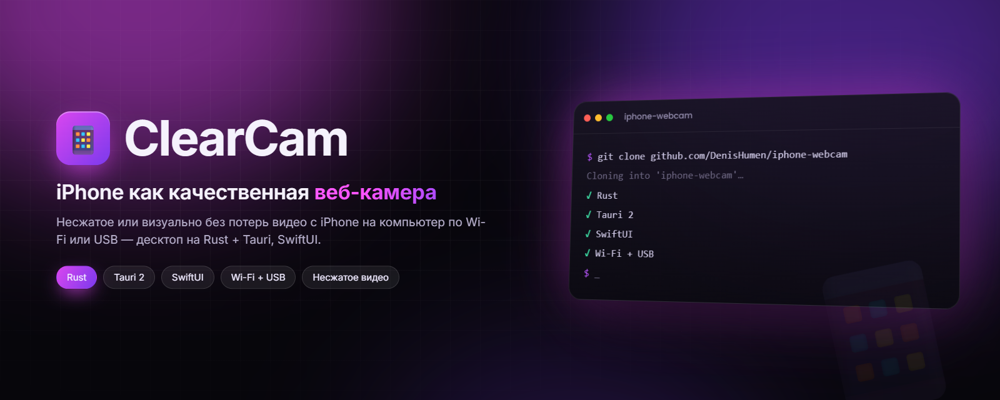
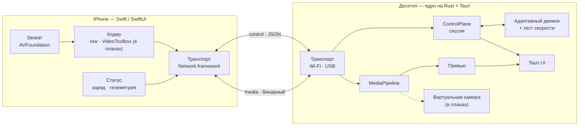

<div align="center">



# ClearCam

**Превращает iPhone в качественную веб-камеру для компьютера: истинно несжатое видео, когда канал позволяет, и визуально без потерь, когда нет — по Wi-Fi или USB.**

[](desktop/Cargo.toml)
[](desktop/src-tauri/tauri.conf.json)
[](desktop/ui/package.json)
[](ios/Package.swift)
[](#-дорожная-карта)
[](https://github.com/DenisHumen/iphone-webcam/commits/main)

[English](README.md) · **Русский**

[Возможности](#-возможности) · [Быстрый старт](#-быстрый-старт) · [Архитектура](#-стек-и-архитектура) · [Дорожная карта](#-дорожная-карта) · [Документация](#-документация)

</div>

---

**ClearCam** (рабочее название, можно сменить; репозиторий `iphone-webcam`) превращает iPhone в веб-камеру для
компьютера. iPhone снимает видео и передаёт его на десктоп по Wi-Fi или USB; десктоп показывает живое превью, даёт
управлять телефоном и по замыслу публикует поток как **системную виртуальную камеру**, которую видят Zoom, Google
Meet, OBS, приложения записи и т. д.

Главная идея — **честное качество**: передавать истинно несжатое видео, когда канал это позволяет, и автоматически
переключаться на режим «визуально без потерь» (лёгкое сжатие, неотличимое глазом), когда не позволяет. Что именно
влезает в канал — решает встроенный **тест скорости**.

> [!NOTE]
> **Проект в разработке.** Путь по Wi-Fi — привязка по QR, handshake, живое RAW-превью в десктоп-приложении,
> переключение объективов и телеметрия — реализован в обоих приложениях и проходит автоматические end-to-end тесты
> с мок-iPhone на Rust; приёмка на реальном iPhone пока не проведена. USB-транспорт, тест скорости и адаптивное
> качество реализованы в ядре и покрыты end-to-end тестами, но ещё не полностью подключены к приложениям.
> **Виртуальной камеры пока нет** — она ждёт Apple Developer ID. Подробнее — в [дорожной карте](#-дорожная-карта).
> Интерфейс приложений сейчас на русском.

## ✨ Возможности

| | Возможность | Статус |
|---|---|---|
| 📡 | **Привязка по Wi-Fi через QR** — десктоп показывает QR с хостом, портами и случайным токеном сессии; iPhone сканирует его (или значения вводятся вручную) | ✅ реализовано |
| 🖼 | **Живое RAW-превью** — NV12-кадры с камеры iPhone, буфер с отбрасыванием старых кадров, JPEG-превью (≤ 30 fps) в десктоп-приложении | ✅ реализовано |
| 📷 | **Переключение объективов с десктопа** — фронтальная, основная, ультраширик, телевик (какие есть у телефона) | ✅ реализовано |
| 🔋 | **Карточка устройства и телеметрия** — модель, версия iOS, заряд, тепловое состояние, битрейт отправки, камеры с максимальным разрешением и fps | ✅ реализовано |
| 🔁 | **Переподключение** — при разрыве сессия переходит в *reconnecting* и восстанавливается без перезапуска десктопа | ✅ реализовано |
| 🔌 | **USB-транспорт** — usbmuxd через чистый Rust-крейт `idevice`, ключи привязки для каждого устройства, кабель приоритетнее Wi-Fi | 🧪 ядро + e2e-тесты; список устройств и окно доверия в десктоп-приложении |
| 🧪 | **Тест скорости и адаптивное качество** — ramp-тест по media-сокету, табличный выбор режима, цикл адаптации с гистерезисом (`SET_MODE` → `MODE_APPLIED`) | 🧪 ядро + e2e-тесты с мок-iPhone |
| 🎚 | **Гибридное качество** — raw YUV 4:2:0 ↔ визуально без потерь HEVC/H.264 (VideoToolbox) | ⏳ кодер/декодер ещё не реализованы |
| 🎥 | **Системная виртуальная камера** — CMIO Camera Extension на macOS, затем Media Foundation (Windows) и v4l2loopback (Linux) | ⏳ ждёт Apple Developer ID |
| 🖥 | **Кросс-платформенный десктоп** — сначала macOS, затем Windows, затем Linux | ⏳ в планах |

## 🚀 Быстрый старт

Это сборка для разработчиков: релизов пока нет.

### Что понадобится

| Часть | Требования |
|---|---|
| Ядро и оболочка десктопа | Rust stable (`rustfmt`, `clippy`), [Tauri 2 CLI](https://tauri.app) (`cargo tauri`) |
| UI десктопа | Node.js 20 и pnpm 10 (версии из CI) |
| Десктоп на Linux | системные пакеты Tauri 2 — `libwebkit2gtk-4.1-dev`, `build-essential`, `libssl-dev`, `libayatana-appindicator3-dev`, `librsvg2-dev`, … (см. [`.github/workflows/ci.yml`](.github/workflows/ci.yml)) |
| Приложение для iPhone | macOS с Xcode (Swift 5.9, iOS 17 SDK), [XcodeGen](https://github.com/yonaskolb/XcodeGen), реальный iPhone на iOS 17+ |

### Десктоп-приложение

```bash
git clone https://github.com/DenisHumen/iphone-webcam.git
cd iphone-webcam/desktop
pnpm --dir ui install
cargo tauri dev
```

Нажмите **Запустить сервер**: приложение начнёт слушать случайные control- и media-порты и покажет QR-код.

### Приложение для iPhone

Из корня репозитория:

```bash
./scripts/regen-xcode.sh      # генерирует ios/ClearCam.xcodeproj из ios/project.yml (нужен xcodegen)
```

Откройте `ios/ClearCam.xcodeproj` в Xcode, укажите свой `DEVELOPMENT_TEAM` и запустите таргет `ClearCam` на реальном
iPhone (в симуляторе камера не работает). Разрешите доступ к камере и локальной сети, отсканируйте QR-код с
десктопа — в десктоп-приложении должно появиться живое превью.

### Нет iPhone? Есть мок

`desktop/tools/mock-iphone` — замена телефона на Rust: проходит handshake, шлёт телеметрию и синтетические
NV12-кадры. С ним работают end-to-end тесты десктопного ядра:

```bash
cd desktop
cargo test --workspace --all-targets
cargo run -p mock-iphone -- --help
# mock-iphone --host <host> --cport <port> --mport <port> --token <token>
#   [--width N --height N --fps N --no-video --transport wifi|usb --congested]
```

### Требования для USB

- **macOS:** usbmuxd входит в «Apple Mobile Device» — уже встроен.
- **Linux:** `./scripts/setup-linux-usbmuxd.sh` ставит `usbmuxd` + `libimobiledevice` (apt) и поднимает службу;
  проверка — `idevice_id -l`.
- **Windows:** нужен Apple Mobile Device Support (входит в iTunes / Apple Devices). USB-путь на Windows ещё не
  проверен (Фаза 7).

Настоящий бэкенд usbmuxd включается Cargo-фичей — собирайте десктоп-оболочку с `--features usb-idevice`; без неё
используется внутрипроцессная loopback-заглушка.

## ⚙️ Конфигурация

Файла конфигурации пока нет. Что можно настроить:

| Параметр | Где | По умолчанию |
|---|---|---|
| Уровень логов | переменная окружения `RUST_LOG` (tracing `EnvFilter`) | `info,tauri=warn` |
| Настоящий USB-бэкенд | Cargo-фича `usb-idevice` у `clearcam-desktop` / `transport` | выключен (loopback-заглушка) |
| Ключи USB-привязки | `pairings.toml` в системном каталоге настроек `ClearCam` (через крейт `directories`) | создаётся при первом доверии |
| Порты Wi-Fi | выбираются ОС при каждом запуске сервера и передаются в QR-коде | случайные |

## 🧱 Стек и архитектура

| Часть | Технологии |
|---|---|
| Клиент на iPhone | Swift, SwiftUI, AVFoundation, Network.framework (VideoToolbox — в планах) |
| Ядро десктопа | Rust workspace, Tokio, serde |
| UI десктопа | Tauri 2 (Rust-бэкенд) + React 18, TypeScript, Vite, Tailwind CSS |
| Виртуальная камера (в планах) | CMIO Camera Extension (macOS) · Media Foundation (Windows) · v4l2loopback (Linux) |
| Транспорт | два TCP-соединения на сессию поверх Wi-Fi или USB (usbmuxd через крейт `idevice`) |



Каждая сессия использует два TCP-соединения, чтобы команда не застревала в очереди за большим видеокадром:
**control** (JSON с префиксом длины — handshake, авторизация, сведения об устройстве, телеметрия, команды камеры и
режима, тест скорости) и **media** (бинарный 28-байтовый заголовок, за которым идёт кадр). Полный контракт — в
[docs/03-protocol.md](docs/03-protocol.md); решения зафиксированы в виде ADR в
[docs/12-decisions-log.md](docs/12-decisions-log.md).

## 📁 Структура проекта

```
.
├── desktop/                  # десктоп-приложение (Rust workspace)
│   ├── crates/
│   │   ├── ccp-protocol/     # control-сообщения (serde) + бинарный media-заголовок, версии/caps
│   │   ├── transport/        # Wi-Fi TCP сервер/клиент, USB-кондукторы (usbmuxd), фрейминг
│   │   ├── session/          # handshake, актор ControlPlane, keepalive, привязка
│   │   ├── adaptive/         # тест скорости, выбор режима, машина состояний адаптации
│   │   ├── mediapipeline/    # чтение media, буфер drop-oldest, счётчик теста скорости
│   │   ├── decode/           # трейт Decoder (пока passthrough)
│   │   ├── sink/             # Frame + трейт FrameSink
│   │   └── app/              # сборка ядра: AppCore, USB-супервизор, хранилище ключей, драйвер адаптации
│   ├── src-tauri/            # оболочка Tauri 2: команды, события, превью-сток
│   ├── ui/                   # фронтенд на React + TypeScript + Vite + Tailwind
│   ├── tools/mock-iphone/    # мок-iPhone на Rust для тестов и локальных прогонов
│   └── sinks/                # место под стоки виртуальной камеры (пока пусто)
├── ios/                      # SwiftPM-пакет + project.yml для XcodeGen
│   ├── Sources/ClearCamProtocol/   # типы протокола — зеркало ccp-protocol
│   ├── Sources/ClearCamCore/       # захват, кодирование, привязка, сессия, транспорт, статус
│   ├── Sources/ClearCamApp/        # SwiftUI-приложение (QR-сканер, экраны подключения)
│   └── Tests/
├── docs/                     # проектная документация
├── plans/                    # поэтапные планы реализации с журналами приёмки
└── scripts/                  # dev-скрипты: regen-xcode, setup-linux-usbmuxd, swift-env, dev-usb
```

## 📚 Документация

Вся проектная документация — в каталоге [`docs/`](docs/). Начните с индекса [docs/README.md](docs/README.md) —
там порядок чтения и краткий статус — и канонического дизайн-спека
[docs/superpowers/specs/2026-05-26-iphone-webcam-design.md](docs/superpowers/specs/2026-05-26-iphone-webcam-design.md).

| # | Документ | О чём |
|---|---|---|
| 01 | [Видение и требования](docs/01-vision-and-requirements.md) | цели, не-цели, сценарии, функциональные и нефункциональные требования |
| 02 | [Архитектура](docs/02-architecture.md) | компоненты, границы, поток данных |
| 03 | [Протокол](docs/03-protocol.md) | handshake, каналы управления и данных, формат кадров, версионирование |
| 04 | [Приложение для iOS](docs/04-ios-app.md) | захват, кодеки, переключение камер, батарея, транспорт, UI |
| 05 | [Десктоп-приложение](docs/05-desktop-app.md) | модули Rust-ядра, Tauri-UI, стоки виртуальной камеры, медиа-конвейер |
| 06 | [Адаптивный движок и тест скорости](docs/06-adaptive-engine-and-speedtest.md) | тест скорости, выбор режима, математика битрейта, цикл адаптации |
| 07 | [UI/UX](docs/07-ui-ux.md) | экраны, состояния, язык дизайна |
| 08 | [Структура проекта](docs/08-project-structure.md) | раскладка репозитория, границы модулей, сборка |
| 09 | [Стек технологий](docs/09-tech-stack.md) | языки, фреймворки, платформенные API и обоснование |
| 10 | [Дорожная карта и план](docs/10-roadmap-and-plan.md) | фазы, вехи, критерии приёмки |
| 11 | [Стратегия тестирования](docs/11-testing-strategy.md) | тестирование всех компонентов |
| 12 | [Журнал решений](docs/12-decisions-log.md) | ADR: что выбрали, почему, что отвергли |
| 13 | [Глоссарий](docs/13-glossary.md) | термины |
| 14 | [Apple Developer ID](docs/14-apple-developer-id-guide.md) | как получить Developer ID и сертификаты для подписи macOS-релиза и CMIO-расширения |

## 🗺 Дорожная карта

Реализация идёт по фазам из [docs/10-roadmap-and-plan.md](docs/10-roadmap-and-plan.md); для каждой фазы в
[`plans/`](plans/) есть подробный план с журналом приёмки.

| Фаза | Объём | Статус |
|---|---|---|
| 0 — Фундамент | Rust workspace, `ccp-protocol`, оболочка Tauri + React, iOS-пакет протокола, CI | ✅ готово |
| 1 — Транспорт и handshake | Wi-Fi TCP, handshake и авторизация по токену, сведения об устройстве, телеметрия, QR, переподключение | ✅ готово (проверка на устройстве впереди) |
| 2 — RAW-видео + превью | захват NV12 на iOS, медиа-конвейер, превью на десктопе, переключение объективов | ✅ готово (проверка на устройстве впереди) |
| 3 — Виртуальная камера (macOS) | CMIO Camera Extension, передача кадров в расширение | ⏳ ждёт Apple Developer ID |
| 4 — Кодер, тест скорости, адаптация | адаптивный движок, выбор режима, трейт декодера | 🟡 частично: движок готов, кодер/декодер VideoToolbox впереди |
| 5 — USB-транспорт | кондуктор usbmuxd, ключи привязки, приоритет кабеля, окно доверия | ✅ готово (на реальном устройстве ещё не проверялось) |
| 6a / 6b — USB-сессия и цикл адаптации | USB handshake → конвейер, драйвер адаптации, живой тест скорости | ✅ готово (headless, с мок-iPhone) |
| 6c — Доводка на железе | кодирование/декодирование VideoToolbox, декодер ffmpeg, переход Wi-Fi ↔ USB, настройка переподключений, тесты на устройстве | ⏳ следующая |
| 7 — Windows | виртуальная камера на Media Foundation, USB через Apple Mobile Device Support | ⏳ после v1 |
| 8 — Linux | сток v4l2loopback, пакетирование, декод через ffmpeg/VAAPI | ⏳ после v1 |
| 9 — Звук | аудиодорожка в протоколе, виртуальный микрофон, AV-синхронизация | ⏳ после v1 |
| 10 — Несколько источников | несколько телефонов, переключатель активного источника | ⏳ после v1 |

## 🧪 Тестирование

Те же проверки, что CI выполняет на каждый push:

```bash
# Rust (из desktop/)
cargo fmt --all -- --check
cargo clippy --workspace --all-targets -- -D warnings
cargo test --workspace --all-targets

# UI (из desktop/ui/)
pnpm install --frozen-lockfile
pnpm typecheck && pnpm lint && pnpm format:check && pnpm build

# iOS-пакет (из ios/, на macOS)
swift build
swift test
```

Если `swift` подхватывает Command Line Tools вместо Xcode, сначала выполните `. scripts/swift-env.sh`.

## 🤝 Участие в разработке

Issues и pull requests приветствуются. Перед изменениями прочитайте соответствующий документ и соблюдайте границы
модулей из [docs/08-project-structure.md](docs/08-project-structure.md); новые архитектурные решения оформляйте
новым ADR в [docs/12-decisions-log.md](docs/12-decisions-log.md).

## 📄 Лицензия

Лицензия пока не указана.
