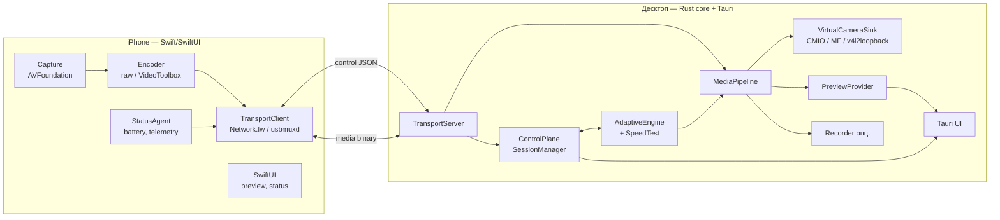

# 02 — Архитектура

Связанные документы: [03-protocol.md](03-protocol.md), [04-ios-app.md](04-ios-app.md),
[05-desktop-app.md](05-desktop-app.md), [08-project-structure.md](08-project-structure.md).

## 1. Обзор

Система состоит из двух приложений, общающихся по единому протоколу поверх взаимозаменяемых
транспортов (Wi-Fi или USB):

```
┌───────────────────────────┐                         ┌──────────────────────────────────────┐
│        iPhone (Swift)      │                         │   Десктоп (Rust core + Tauri UI)       │
│                            │   control plane (JSON)  │                                        │
│  Capture ─► Encoder ──┐    │ ◄─────────────────────► │  TransportServer ─► ControlPlane        │
│   (AVF)   (raw/VT)    │    │                         │        │              │                 │
│                       ├────┼── media plane (binary) ─┼───────►│        AdaptiveEngine          │
│  StatusAgent          │    │                         │        ▼              │                 │
│  (battery, telemetry) │    │                         │   MediaPipeline ◄─────┘                 │
│                       │    │                         │        │                                │
│  TransportClient ◄────┘    │                         │        ├─► VirtualCameraSink (CMIO/MF/  │
│  (Network.fw / usbmuxd)    │                         │        │      v4l2loopback)             │
│                            │                         │        ├─► PreviewProvider ─► Tauri UI   │
│  SwiftUI (preview/status)  │                         │        └─► Recorder (опц.)              │
└───────────────────────────┘                         └──────────────────────────────────────┘
            ▲                                                            ▲
            │  Wi-Fi (TCP, mDNS, QR)  ──── один протокол ────  USB (usbmuxd)  │
            └────────────────────────────────────────────────────────────────┘
```

Та же схема в Mermaid:



## 2. Два логических плана

Связь делится на два независимых потока сообщений, идущих по **двум TCP-соединениям** (см.
[03-protocol.md](03-protocol.md) §«Соединения»):

- **Control plane** — низкочастотные сообщения JSON: команды (сменить камеру, старт/стоп, выбор
  режима), телеметрия (батарея, fps, потери), обмен теста скорости, keepalive. Отдельное соединение
  гарантирует, что команда не застрянет в очереди за большим видеокадром.
- **Media plane** — высокочастотный бинарный поток видеокадров (raw или закодированных). Большие
  буферы, приоритет на пропускную способность.

## 3. Компоненты

Для каждого компонента: **что делает / как используется (интерфейс) / от чего зависит.** Точные
сигнатуры появятся в коде; здесь — контракты.

### 3.1. Сторона iPhone (см. [04-ios-app.md](04-ios-app.md))

- **CaptureEngine** — что: захватывает кадры с выбранного объектива через AVFoundation, выдаёт
  `CVPixelBuffer` (NV12). Интерфейс: `start(camera, format)`, `stop()`, `setCamera(id)`, поток кадров +
  колбэк параметров. Зависит: AVFoundation, права на камеру.
- **Encoder** — что: превращает кадр либо в raw-пакет (NV12 как есть), либо в закодированный
  (VideoToolbox HEVC/H.264) согласно текущему режиму. Интерфейс: `setMode(mode)`, `encode(frame) -> MediaFrame`.
  Зависит: VideoToolbox, CaptureEngine.
- **TransportClient** — что: устанавливает control+media соединения с десктопом, сериализует/шлёт
  кадры и сообщения, принимает команды. Интерфейс: `connect(peer)`, `send(control)`, `send(media)`,
  поток входящих control-сообщений. Зависит: Network.framework (Wi-Fi), usbmuxd-listener (USB).
- **StatusAgent** — что: собирает заряд/состояние батареи, тепловое состояние, метрики отправки;
  периодически шлёт телеметрию. Интерфейс: `telemetryStream`. Зависит: UIDevice/ProcessInfo.
- **SessionController (iOS)** — что: state machine соединения/трансляции, реагирует на команды
  (например `SET_CAMERA` → `CaptureEngine.setCamera`), обслуживает тест скорости. Зависит: всё выше.
- **UI (SwiftUI)** — что: экран подключения (скан QR / статус), экран трансляции (превью, индикаторы).

### 3.2. Сторона десктопа (см. [05-desktop-app.md](05-desktop-app.md))

- **TransportServer** — что: принимает входящие соединения (Wi-Fi) и инициирует исходящие (USB через
  usbmuxd); отдаёт наверх абстрактную пару потоков (control, media) + идентичность пира. Интерфейс:
  `listen()/dial(device)`, события «peer connected/lost», `controlChannel`, `mediaChannel`. Зависит:
  tokio (async I/O), mDNS-библиотека, libusbmuxd-обёртка.
- **ControlPlane / SessionManager** — что: хранит состояние сессии и устройства (камеры, режим,
  телеметрия), маршрутизирует команды/события между UI, AdaptiveEngine и пиром. Это «единый источник
  правды» о сессии. Интерфейс: `apply(command)`, `state()/stateStream`. Зависит: TransportServer.
- **AdaptiveEngine (+ SpeedTest)** — что: запускает тест скорости, выбирает режим, следит за каналом и
  адаптирует. Интерфейс: `runSpeedTest() -> Measurement`, `recommend(measurement,caps) -> Mode`,
  `onTelemetry(t)`. Зависит: ControlPlane (команды смены режима), часы. См. [06](06-adaptive-engine-and-speedtest.md).
- **MediaPipeline** — что: принимает media-кадры, при необходимости декодирует (VideoToolbox/MF/VAAPI)
  или пропускает raw, приводит к каноническому NV12, управляет таймингом/джиттер-буфером (минимальным),
  раздаёт кадры потребителям. Интерфейс: `pushEncoded/ pushRaw`, подписка `FrameSink`. Зависит:
  платформенный декодер (через адаптер), VirtualCameraSink, PreviewProvider, Recorder.
- **VirtualCameraSink** — что: публикует кадры в системную виртуальную камеру. Платформенный адаптер
  за общим трейтом `FrameSink`. Реализации: macOS CMIO Camera Extension, Windows MF, Linux v4l2loopback.
  Интерфейс (трейт): `start(format)`, `submit(frame)`, `stop()`. Зависит: платформенные API.
- **PreviewProvider** — что: отдаёт кадры в Tauri-UI для превью (downscale, RGBA, ограничение fps до UI).
  Интерфейс: `FrameSink` → канал в UI. Зависит: MediaPipeline, Tauri IPC.
- **Recorder (опц.)** — что: пишет принимаемый поток в файл (контейнер + кодек). Интерфейс: `FrameSink`,
  `start(path)/stop()`. Зависит: мультиплексор (например, через ffmpeg-обёртку).
- **Tauri UI** — что: дашборд (превью, батарея, метрики, выбор камеры, тест скорости, режим).
  Зависит: ControlPlane (команды/состояние через Tauri IPC), PreviewProvider.

## 4. Поток данных (end-to-end), стационарный режим

1. CaptureEngine выдаёт NV12-кадр с меткой времени захвата (µs).
2. Encoder формирует `MediaFrame` (raw NV12 или закодированный AU) по текущему режиму.
3. TransportClient отправляет `MediaFrame` по media-соединению (см. формат — [03](03-protocol.md)).
4. TransportServer принимает кадр → MediaPipeline.
5. MediaPipeline (если закодирован) декодирует → NV12; ведёт минимальный джиттер-буфер; при отставании
   **дропает**, не копит (NFR-2).
6. MediaPipeline раздаёт NV12-кадр в VirtualCameraSink (главный потребитель), PreviewProvider, Recorder.
7. VirtualCameraSink публикует кадр; внешнее приложение (Zoom/OBS) получает его как кадр веб-камеры.

Параллельно: StatusAgent шлёт телеметрию (батарея/fps/потери) по control plane → ControlPlane → UI;
AdaptiveEngine анализирует телеметрию и при необходимости шлёт телефону `SET_MODE`.

Диаграмма последовательности подключения и старта — в [03-protocol.md](03-protocol.md) §«Сценарии».

## 5. Абстракция `Source` (задел под мульти-камеру)

ControlPlane оперирует не «телефоном», а **источником** (`Source`): сущностью с идентичностью,
списком камер, состоянием, телеметрией и привязанными control/media-каналами. В v1 источник всегда
один. Мульти-камера (несколько iPhone) в будущем — это коллекция `Source` + «активный источник» для
VirtualCameraSink + (опционально) переключатель/композитор. Ядро и протокол этого не запрещают.

**Граница, которую нельзя нарушать:** MediaPipeline и VirtualCameraSink работают с потоком кадров от
*активного* источника; добавление источников не должно требовать их изменения — только маршрутизацию
в ControlPlane.

## 6. Модель конкурентности (десктоп, Rust)

- Асинхронная среда **tokio**. Сетевой I/O — async задачи.
- **Media-путь — отдельная задача/поток** с приоритетом, не блокируется UI и control-логикой.
- Между стадиями — **bounded-каналы** (например `tokio::sync::mpsc` с малой ёмкостью) с политикой
  **drop-oldest** на видео-пути: переполнение означает «потребитель отстаёт» → выбрасываем старый кадр,
  сохраняя низкую задержку (NFR-2).
- Декодирование/энкодинг — на пуле блокирующих задач (`spawn_blocking`) или через аппаратные API.
- Состояние сессии — за одним владельцем (actor-паттерн: задача ControlPlane владеет состоянием,
  остальные шлют ей сообщения), чтобы избежать гонок и сложных блокировок.
- Tauri-UI получает данные через каналы/события, не делит изменяемое состояние напрямую.

## 7. Домены отказов и восстановление

| Отказ | Поведение |
|---|---|
| Разрыв Wi-Fi/USB | Сессия → `reconnecting`; авто-переподключение; UI показывает статус; виртуальная камера отдаёт «заставку/последний кадр», а не падает |
| Просадка пропускной способности | AdaptiveEngine снижает режим без обрыва (NFR-4); уведомление в UI |
| Отставание потребителя | drop-oldest на каналах, задержка не растёт |
| Низкий заряд/перегрев телефона | StatusAgent сигналит; UI предупреждает; опц. авто-снижение режима |
| Сбой расширения камеры (macOS) | Десктоп детектит отсутствие sink, показывает инструкцию по установке/разрешению |
| Несовместимость версий протокола | Handshake отклоняет с понятной ошибкой (см. [03](03-protocol.md) §«Версионирование») |

## 8. Сквозные принципы

- **Платформенное — только за адаптерами** (VirtualCameraSink, USB-транспорт, аппаратные кодеки).
  Rust-ядро компилируется и тестируется без них (моки).
- **Один протокол — два транспорта.** Транспорт скрыт за интерфейсом, выдающим пару потоков.
- **Кадр — единица данных.** Канонический формат в конвейере — **NV12** (совпадает с нативом iPhone и
  входом стоков камер), что минимизирует конверсии.
- **Backpressure через drop, а не через рост буфера.** Латентность важнее полноты кадров.
